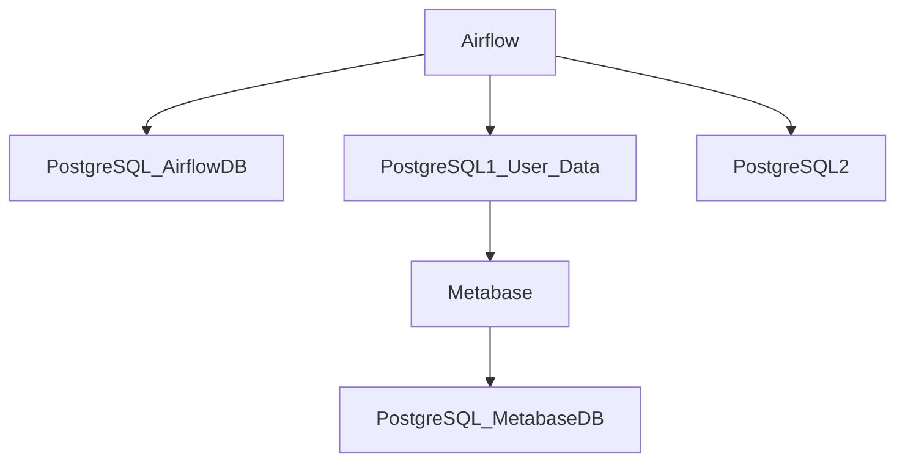

# Airflow Data Generator

## Overview

This project, Airflow Data Generator, demonstrates how to orchestrate data generation and processing tasks using Apache Airflow and PostgreSQL. It leverages a multi-container Docker setup for easy deployment and management. The project includes:

-   **Airflow DAGs**: Defines workflows for data generation and processing, including connections to multiple PostgreSQL databases. Currently, the dual_postgres_dag.py DAG demonstrates querying two separate Postgres databases.
-   **PostgreSQL Integration**: Uses PostgreSQL as the backend database for Airflow metadata and also includes multiple Postgres containers for demonstrating data interaction with different databases.
-   **Dockerized Environment**: Utilizes Docker Compose to manage the multi-container environment, including Airflow, PostgreSQL (for Airflow metadata), and additional PostgreSQL instances for data processing.
-   **Automated Build Process**: Includes a Makefile for streamlined building and running of the Docker environment.

The project aims to provide a practical example of how to use Airflow to orchestrate data-related tasks, interact with multiple databases, and manage the entire process within a containerized environment. It serves as a starting point for building more complex data pipelines and workflows. Future development may include more sophisticated data generation tasks, data transformation logic, and integration with other data processing tools.

## 🚀 Features

-   Airflow orchestration
-   PostgreSQL database integration
-   Metabase data visualization tool
-   Dynamic table creation and population: Create and populate tables based on JSON table definitions, allowing for flexible data generation.

## Architecture



## DAGs

This project includes two main DAGs:

-   **users_table.py**: This DAG generates fake user data using the Faker library, inserts it into a PostgreSQL table named users and update the user's email. It runs on a schedule of every minute.
-   **dual_postgres_dag.py**: This DAG demonstrates querying two separate Postgres databases (postgres1 and postgres2). It currently executes a simple SELECT NOW() query on each database.

## 🛠 Tech Stack

-   Python: 3.12
-   PostgreSQL: 15
-   Airflow: 2.10.5
-   Metabase: 0.53.5.4
-   Docker: 4.38.0
-   Docker Compose

## 📦 Prerequisites

-   Docker and Docker Compose installed.
-   Python 3.12+ (for local development and testing).

## 🔧 Installation

### Clone Repository

```bash
git clone https://github.com/augsmachado/airflow-data-generator.git
cd airflow-data-generator
```

### 🚦 Running the Application

Start the Docker container

```bash
make docker-init
```

This command will build and start all the necessary containers, including Airflow, PostgreSQL, and Metabase. It also initializes the Airflow database, creates an admin user, and sets up the Metabase database connection.

To verify if containers are running, execute

```bash
make docker-verify
```

### Access Airflow

Open your web browser and navigate to http://localhost:8080. Log in with the default credentials:

-   Username: admin
-   Password: admin

In the tab **Admin**, choose **Connections** and set this variables to create a new connection with our Postgres database:

-   **Connection id**: postgres1_conn
-   **Connection type**: Postgres
-   **Schema**: db1
-   **Login**: usr1
-   **Password**: pwd
-   **Port**: 5432

### Access Metabase

Open your web browser and navigate to http://localhost:3000. You'll need to complete the Metabase setup wizard, connecting it to the postgres1 database with the following credentials:

-   Host: metabase_db
-   Port: 5432
-   Database: metabase
-   Username: metabase_usr
-   Password: metabase_pwd

### 🔍 Testing

Run the tests using

```bash
make python-test
```

## Makefile Targets

The included Makefile provides several useful commands for managing the project:

-   **make docker-init**: Builds and starts the Docker containers.
-   **make docker-rebuild**: Rebuilds and restarts the Docker containers.
-   **make docker-verify**: Lists running Docker containers.
-   **make docker-logs**: Displays logs from the Docker containers.
-   **make docker-down**: Stops and removes the Docker containers.
-   **make python-test**: Runs the Python tests using pytest.
-   **make venv-create**: Creates a virtual environment.
-   **make venv-activate**: Activates the virtual environment.
-   **make venv-deactivate**: Deactivates the virtual environment.
-   **make venv-install**: Installs project dependencies.
-   **make venv-freeze**: Freezes dependencies into requirements.txt.

### 🤝 Contributing

Feel free to submit issues or pull requests for improvements or bug fixes. Use the framework below:

-   Fork the repository
-   Create your feature branch
-   Commit your changes
-   Push to the branch
-   Create a Pull Request

### 📄 License

This project is licensed under the Apache License 2.0.
See the LICENSE file for details.
